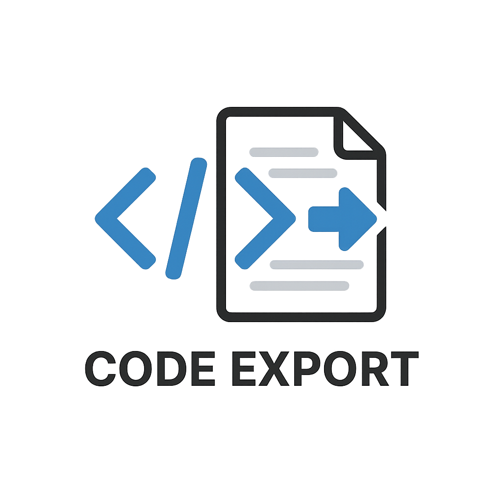
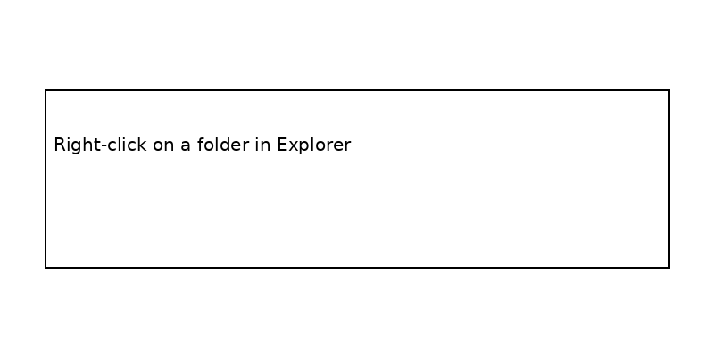

# Code Dump to TXT/MD

Export your workspace into a single `.txt`, `.md`, or `.json` file for AI tools, documentation, or archiving.



---

## Visual walkthrough



---

## Quick start

### Context menu (recommended)
1) Right-click a folder in the VS Code Explorer.
2) Choose **Export Code to TXT/MD**.
3) Select extensions, template, and output format.
4) Save the file.

### Command palette
1) Press `Ctrl+Shift+P` (`Cmd+Shift+P` on macOS).
2) Run **Code Dump: Export Current Workspace**.
3) Follow the prompts.

---

## What you get

### Markdown / Text export
- One file (or chunked parts) with your code.
- Optional metadata per file.
- Token estimates shown during export.

### JSON export (structured)
Includes per-file metadata and optional dependency graph.

Example JSON metadata:
```json
{
  "metadata": {
    "exportedAt": "2026-01-29T12:34:56.000Z",
    "sourceFolder": "my-project",
    "totalFiles": 42,
    "totalSize": 123456,
    "totalLines": 7890,
    "estimatedTokens": 30864,
    "extensions": [".ts", ".md"],
    "version": "1.0",
    "dependencies": {
      "src/index.ts": ["src/utils.ts", "src/types.ts"],
      "src/utils.ts": ["src/types.ts"]
    }
  },
  "files": []
}
```

---

## AI Context Optimizer

Reduce token usage automatically during export.

```json
{
  "codeDump.aiContextOptimizer": {
    "enabled": true,
    "maxTokenBudget": 100000,
    "removeComments": true,
    "removeDocstrings": true,
    "minifyWhitespace": true,
    "truncateLargeFiles": true,
    "maxLinesPerFile": 500,
    "prioritizeRecentFiles": true
  }
}
```

What it does:
- Removes redundant comments.
- Removes docstrings/doc comments when enabled.
- Minifies extra whitespace.
- Truncates large files with a `// ... truncated ...` marker.
- Prioritizes entry points and recent files when the token budget is tight.

---

## AI Export Pack

Generate an AI-ready bundle in one click:
- JSON export with `contextSummary`, optimization stats, and optional dependency graph.
- Dependency graph now understands tsconfig/jsconfig path aliases (e.g. `@/components/*`).
- Markdown export with a context summary and a ready-to-use AI prompt template.
- Preset defaults: `ai-ready` template, `.json` output, preview enabled, empty files skipped.

What’s included in `contextSummary`:
- Included/excluded file lists with reasons (e.g. `gitignore`, `sensitive`, `token-budget`).
- Token budget used for selection.
- Auto-generated prompt template you can paste into an AI chat.

---

## Privacy Mode

Mask sensitive data during export with regex-based redaction.

- Masks emails, common tokens (JWT/Bearer/prefixes), and API keys/secrets.
- Generates a report with total masks, per-type counts, and per-file stats.
- Toggle it directly in the export webview.

---

## PDF Export

Use `.pdf` output to generate a Markdown-like PDF, useful as a NotebookLM source.
If `pdf-lib` is not installed yet, run `npm install` after pulling updates.
The extension bundles `pdf-lib` in the VSIX to avoid activation errors.
`pdf-lib` requires `tslib`, which is also bundled.
`pdf-lib` standard fonts are bundled as well.
`@pdf-lib/standard-fonts` requires `pako`, which is bundled too.

---

## NotebookLM Enterprise Upload

If you have NotebookLM Enterprise, you can upload the exported file directly.
Enable it in settings and use the webview checkbox.

### How to obtain an access token

NotebookLM Enterprise uses a Google OAuth access token. You can use one of the following methods:

**1) gcloud CLI (fastest)**
1) Login with your Google account:
   `gcloud auth login`
2) Get a token:
   `gcloud auth print-access-token`
3) Paste the token into `codeDump.notebooklmEnterprise.accessToken` or set
   `NOTEBOOKLM_ACCESS_TOKEN` as an environment variable.

**2) Google Cloud OAuth client (automation)**
1) Create an OAuth client in Google Cloud Console.
2) Run the OAuth flow in your app/server to obtain an access token.
3) Use the token in `codeDump.notebooklmEnterprise.accessToken` or via
   `NOTEBOOKLM_ACCESS_TOKEN`.

**3) Service account (advanced)**
If your organization allows it, you can use a service account to obtain a token
and inject it at runtime (e.g., CI/CD). This requires appropriate permissions
for NotebookLM Enterprise in your Google Cloud project.

Notes:
- Consumer NotebookLM does not expose a stable public API/token.
- Tokens expire; refresh them when uploads start failing.

### Troubleshooting

- **Token expired**: regenerate the token (gcloud or OAuth flow) and update the setting/env var.
- **Missing scopes**: ensure the OAuth token includes the required scopes for NotebookLM Enterprise/Discovery Engine.
- **Permission denied**: verify the account has access to the target project and NotebookLM notebook.
- **Invalid notebook ID**: double-check `notebookId`, `projectNumber`, and `location`.

Example:
```json
{
  "codeDump.notebooklmEnterprise": {
    "enabled": true,
    "projectNumber": "123456789012",
    "location": "global",
    "endpointLocation": "us-",
    "notebookId": "your-notebook-id",
    "accessToken": "ya29...your_token..."
  }
}
```

---

## User Profiles

Create personalized presets and switch them in the export webview.

Example:
```json
{
  "codeDump.userProfiles": [
    {
      "id": "frontend",
      "name": "Frontend",
      "extensions": [".ts", ".tsx", ".css", ".scss"],
      "template": "ai-ready",
      "outputFormat": ".md",
      "skipEmpty": true,
      "showPreview": true,
      "exportPreset": "standard",
      "privacyModeEnabled": true
    }
  ]
}
```

---

## Settings

Add these to your `settings.json`:

```json
{
  "codeDump.defaultExtensions": [".ts", ".js", ".py"],
  "codeDump.outputFormat": ".md",
  "codeDump.openAfterExport": true,
  "codeDump.copyToClipboard": false,
  "codeDump.compactMode": false,
  "codeDump.dryRun": false,
  "codeDump.skipEmptyFiles": "ask",
  "codeDump.showTokenEstimate": true,
  "codeDump.includeMetadata": false,
  "codeDump.includeDependencyGraph": true,
  "codeDump.privacyMode": {
    "enabled": false,
    "maskEmails": true,
    "maskTokens": true,
    "maskApiKeys": true,
    "placeholder": "[REDACTED]",
    "customPatterns": []
  },
  "codeDump.userProfiles": [],
  "codeDump.notebooklmEnterprise": {
    "enabled": false,
    "projectNumber": "",
    "location": "global",
    "endpointLocation": "us-",
    "notebookId": "",
    "accessToken": ""
  }
}
```

UI note: the export dialog now only shows the output path (no redundant file name field).
The dialog also provides a copy button, remembers the last output path, and lets you choose whether to open the exported file.
The dialog includes a read-only operation log with detailed export steps and errors.
Log lines are timestamped for quick tracing.

### Smart filters
```json
{
  "codeDump.smartFilters": {
    "autoExclude": ["node_modules", "dist", "build", ".git", "coverage"],
    "maxFileSize": "1MB",
    "skipBinaryFiles": true,
    "excludePatterns": ["*.log", "*.tmp", "*.cache"]
  }
}
```

---

## Tips

- Use **JSON export** if you want to feed data into tools or build custom pipelines.
- Enable **AI Context Optimizer** to stay within model limits.
- Use **Compact Mode** to shrink output further.
- Add `.codedumpignore` for project-specific exclusions.
- Set `codeDump.showNotifications` to true if you want VS Code toast notifications (default is off; use the webview log instead).
- Set `codeDump.logVerbose` to true for per-file and per-step logging in the webview log (default is off).
- The export webview now includes a quick summary, extension search/filtering, recent paths, and a log level selector.

---

## Development

```bash
npm install
npm run compile
npm run package
```

Tests include privacy masking and filter exclusion coverage:
```bash
npm test
```
These tests are resilient to whitespace-only changes in optimized output.
Truncation tests validate markers rather than specific line positions.

Internal note: export orchestration and integrations live in `src/exportWorkflow.ts`.
Internal note: filesystem access is async with a controlled concurrency limit (`CONCURRENCY_LIMIT`) to avoid blocking the Extension Host.
Internal note: webview assets are now split into `media/main.js` and `media/style.css`.

---

## License

MIT. See `LICENSE`.
